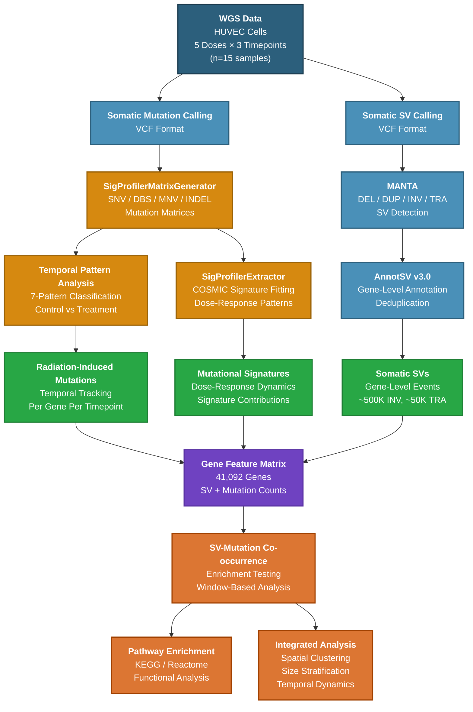

```mermaid
graph TB
    
    %% Input data
    WGS["<b>WGS Data</b><br/>HUVEC Cells<br/>5 Doses × 3 Timepoints<br/>(n=15 samples)"]
    
    %% Variant calling
    WGS --> MUT["<b>Somatic Mutation Calling</b><br/>VCF Format"]
    WGS --> SV["<b>Somatic SV Calling</b><br/>VCF Format"]
    
    %% Mutation processing
    MUT --> SIGPRO["<b>SigProfilerMatrixGenerator</b><br/>SNV / DBS / MNV / INDEL<br/>Mutation Matrices"]
    
    %% SV processing
    SV --> MANTA["<b>MANTA</b><br/>DEL / DUP / INV / TRA<br/>SV Detection"]
    
    %% Parallel analyses
    SIGPRO --> TEMPORAL["<b>Temporal Pattern Analysis</b><br/>7-Pattern Classification<br/>Control vs Treatment"]
    SIGPRO --> COSMIC["<b>SigProfilerExtractor</b><br/>COSMIC Signature Fitting<br/>Dose-Response Patterns"]
    MANTA --> ANNOTSV["<b>AnnotSV v3.0</b><br/>Gene-Level Annotation<br/>Deduplication"]
    
    %% Integration outputs
    TEMPORAL --> RADMUT["<b>Radiation-Induced Mutations</b><br/>Temporal Tracking<br/>Per Gene Per Timepoint"]
    COSMIC --> MUTSIG["<b>Mutational Signatures</b><br/>Dose-Response Dynamics<br/>Signature Contributions"]
    ANNOTSV --> SOMSV["<b>Somatic SVs</b><br/>Gene-Level Events<br/>~500K INV, ~50K TRA"]
    
    %% Gene feature matrix
    RADMUT --> MATRIX["<b>Gene Feature Matrix</b><br/>41,092 Genes<br/>SV + Mutation Counts"]
    MUTSIG --> MATRIX
    SOMSV --> MATRIX
    
    %% Final analyses
    MATRIX --> CONVERGENT["<b>SV-Mutation Co-occurrence</b><br/>Enrichment Testing<br/>Window-Based Analysis"]
    
    CONVERGENT --> ENRICH["<b>Pathway Enrichment</b><br/>KEGG / Reactome<br/>Functional Analysis"]
    CONVERGENT --> MULTIMODAL["<b>Integrated Analysis</b><br/>Spatial Clustering<br/>Size Stratification<br/>Temporal Dynamics"]
    
    %% Styling
    classDef inputStyle fill:#2C5F7C,stroke:#1a3a4d,stroke-width:2px,color:#fff
    classDef processStyle fill:#4A90B8,stroke:#2C5F7C,stroke-width:2px,color:#fff
    classDef analysisStyle fill:#D68910,stroke:#9A6207,stroke-width:2px,color:#fff
    classDef outputStyle fill:#28A745,stroke:#1e7e34,stroke-width:2px,color:#fff
    classDef integrationStyle fill:#6F42C1,stroke:#5a32a3,stroke-width:2px,color:#fff
    classDef finalStyle fill:#DC7633,stroke:#a04000,stroke-width:2px,color:#fff
    
    class WGS inputStyle
    class MUT,SV,MANTA,ANNOTSV processStyle
    class SIGPRO,TEMPORAL,COSMIC analysisStyle
    class RADMUT,MUTSIG,SOMSV outputStyle
    class MATRIX integrationStyle
    class CONVERGENT,ENRICH,MULTIMODAL finalStyle
```